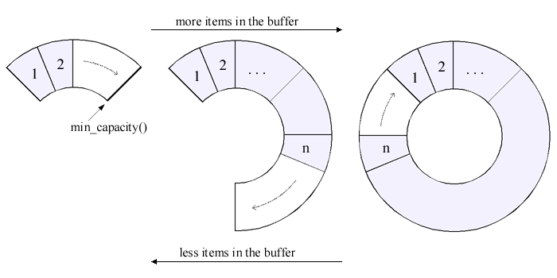

# Re-writing c++ STL containers / Data structures from scratch

### std::vector - implemented

- https://stackoverflow.com/questions/3167272/how-does-c-stdvector-work

The dynamic array is called vector in c++. The unintuitive name aside, this container is a c style array under the hood. It supports pushing and popping to the end, and importantly, it will resize itself once the its size exceeds its capacity. For those looking to implement it, you must use a pointer to a array so you can change the size at runtime, which entails making a new, bigger array, copying the old array over to the new once, and setting your pointer to the new bigger array.


 ### std::string - implemented

Conceptually this is a std::vector, but a char[] instead of a T[]. 

### std::unordered map - implemented
---
**Insertion - O(1)** 

Begin with a list called the "associative array". This is where the actual key-value tuples will be stored under the hood. During insertions we will first hash the key, which produces a number hash, then take that hash % len(array) which is then a index in our associative array, we try to insert our (key, value) tuple at this index. If the index is empty then insert it, if its filled this is a *Hash collision*. There are different ways of dealing with this, the simplest being linear probing where you iterate from index on and first the first empty index and insert there. 

**Access - O(1)** 

Access is similar to insertion. You hash the key, % associative array size, getting the index of where the element should be. If you access index and its a different key, this is a *hash collision* again. And we need a full sweep of the array to find the key.

**Resizing**

Resizing should be done when your load factor reaches a threshold, commonly 0.25 or 0.5. The load factor is the elements in the hashmap / total hashmap capacity. Performance of the hashmap will degrade the higher the load factor.

### std::set 
---
This is trivial to implement once you have implemented a hashmap. But instead of storing (key,value) pairs in your associative array, you just store the keys.

### stack - LIFO

A vector, you pop and push to the back, the back is considered the top of the stack.

### Queue - FIFO

This is similar to a real life queue, elements are added to the back, and removed from the front. An efficient implemention is a linked list, with a pointer to the last element. Another efficient implementation is a circular buffer.

We cover linkeded lists below.

Circular buffers are arrays where the start can be anywhere, and it wraps around from the end to the start. To enqueue we simply move the back pointer up one spot and set that value. Similarly, to dequeue we move the front pointer up one spot. 



Resizing a circular buffer is similar to resizing for a vector. We make a array thats twice as big as the old array, then iterate from the start to the end of the old array and copy it to the new array.

### Linked list - implemented
The linked list is based on a node.

````
struct Node{
    T* val;
    Node* left;
    Node* right;
}
````

A linked list is a linear data structure where each element, called a node, contains data and a reference (or pointer) to the next node, enabling dynamic and efficient insertion and deletion of elements.

Advantages - Fast operations (index/pop/push) at the front/end O(1).

Disadvantages - Indexing is O(n) since full list traversal is required.
### BST - implemented 

A Binary Search Tree (BST) is a data structure that stores data in a hierarchical manner, allowing for efficient searching, insertion, and deletion operations.

At its core is the node from the linked list.

The binary tree's data is a pointer to the root node. It can only take unique values. 

**Insertion - O(h)**

Insertion traverses the tree by going left when the value to be inserted (call it target) `< node.val`, and right when `target > node.val`. A new value will always be inserted at a leaf node. This insertion algorithm can cause unbalanced trees, where their performance degrades, to combat this, self-balancing trees were created (next section).

**Search - O(h)**

Search uses the same traversal algorithm as insertion until it either reaches a null leaf, or it finds the element. 

**Deletion - O(h)**

Deleting a node is the most involved in a BST. It can be broken down into 3 cases.

1. The node to delete has 0 children. 
- Simple sever the tie of the parent with this child.
2. The node to delete has 1 child.
- Connect the node's parent to its child.
3. The node has to delete 2 children.
- There is a trick here. Go in the nodes right sub-tree, find the smallest element and swap it with the node to delete. Then simply delete that smallest node in the right subtree.

### AVL tree 

The AVL tree is a extension of the humble BST. Imagine a normal BST, each node has a "balance factor" = height left - height right. An acceptable balance factor is -1 <= bf <= 1. When a balance factor is not acceptable, a "rotation" is required to rebalance the tree.

### Heap (priority queue)
A heap is a nearly complete binary tree, filled until possibly the last level, which is filled from left to right. There are max-heaps and min-heaps.  In a min heap the root is the smallest element, so O(1) min operation. It is not a binary search tree, so in a min heap both chilren of the root must be greater than the root.


The height of a heap will be log(n). Heaps can be represented as arrays. So that min heap would be `heap = [1,3,2,4,6,5]`. The left child of index i is `2i+1`, the right child is `2i+2`. The parent of an index (still 1-indexed) is `floor(i/2)`.

**Min heapify - O(n)**

This function turns an array into a min heap. You do a level order traversal starting from the second to last level, and you "sift" values up to their correct place.

**Heap pop - O(h)**

This function pops the smallest value from the tree, then it fixes the tree  by "promoting" the smallest values up to fix the path. It essentially swaps the root with the smallest child until it we reach a leaf node, then we remove this node.

**Insert - O(h)**

Insert a value into the heap. You try to insert at the last value, check if its parent is smaller than it, if not swap with the parent and repeat until you either reach the top, or the inserted value is < its parent. 

A result of the heap is heap sort, where you just pop from a min heap n times.

### Graphs
---
A set of nodes and edges. Graphs have no edges and may contain cycles. Connected graphs mean you can get from any node to any other node. Time complexities often expressed in terms of m(# of edges) and n(# of nodes). 
